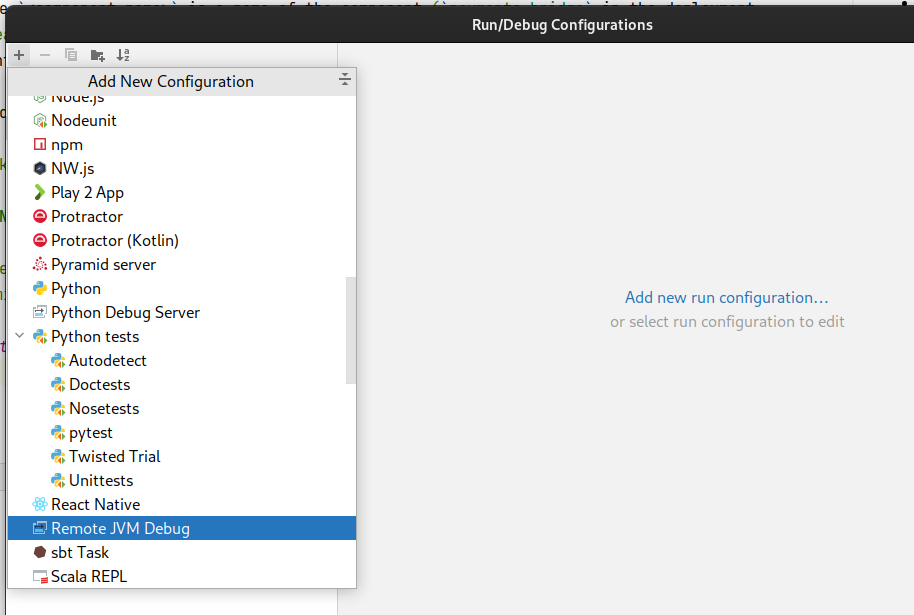
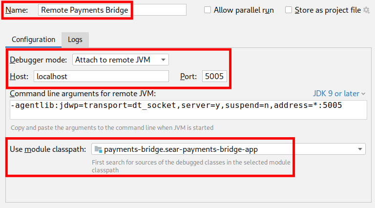

# Debugging in Kubernetes

Java application running in Kubernetes cluster can be configured to run with jdwp, allowing to attach a remote debugger.

To do so, you will have to:

- locate the application deployment you want to debug,
- patch the application deployment to start with jdwp agent,
- remove probes from the deployment,
- forward port from local host to pod,
- attach remote JVM debugger.

## Complete example

The TL;DR version of the guide, for debugging Payments Bridge on port 5005, looks like this:

    kubectl get deploy
    kubectl set env deploy/sear-payments-bridge \
      JAVA_TOOL_OPTIONS=-agentlib:jdwp=transport=dt_socket,server=y,suspend=n,address='*:5005'
    kubectl patch deploy sear-payments-bridge --type='json' \
      --patch='[{"op": "remove", "path":"/spec/template/spec/containers/0/livenessProbe"}, {"op": "remove", "path":"/spec/template/spec/containers/0/readinessProbe"}]'
    kubectl wait deployment sear-payments-bridge --for condition=Available=True
    kubectl get pods --selector=app.kubernetes.io/component=payments-bridge
    kubectl port-forward pod/sear-payments-bridge-XXXXXXXXXX-YYYYY 5005:5005

You can find the details of each command in the following sections.

## Listing deployments

To list all deployments run:

    kubectl get deploy

This will list you all deployments in the current context (i.e., cluster and namespace):

    NAME                                  READY   UP-TO-DATE   AVAILABLE   AGE
    sear-adjudication-engine              1/1     1            1           13m
    sear-company-name-surrounding-agent   1/1     1            1           13m
    sear-frontend                         1/1     1            1           13m
    sear-geo-agent                        1/1     1            1           13m
    sear-geo-agent2                       1/1     1            1           13m
    sear-governance                       1/1     1            1           13m
    sear-historical-decisions-agent       1/1     1            1           13m
    sear-hit-type-name-agent              1/1     1            1           13m
    sear-learning-engine                  1/1     1            1           13m
    sear-mailhog                          1/1     1            1           13m
    sear-name-agent                       1/1     1            1           13m
    sear-organization-name-agent          1/1     1            1           13m
    sear-organization-name-agent2         1/1     1            1           13m
    sear-payments-bridge                  1/1     1            1           13m
    sear-simulator                        1/1     1            1           13m
    sear-universal-data-source            1/1     1            1           13m
    sear-warehouse                        1/1     1            1           13m
    sear-webapp                           1/1     1            1           13m

## Patching application deployment

To patch the deployment, so the application starts with remote debugger agent, run:

    kubectl set env deploy/<deployment name> \
      JAVA_TOOL_OPTIONS=-agentlib:jdwp=transport=dt_socket,server=y,suspend=n,address='*:<port number>'
    kubectl wait deployment <deployment name> --for condition=Available=True

This will restart deployment, starting the remote debugger, and wait for the deployment to become available.

## Removing probes from deployment

Debugging inevitably means setting breakpoints, and breakpoints mean missed probes, and missed probes mean Kubernetes restarting the pod you are trying to debug.

To fix this problem, patch the deployment to remove probes:

    kubectl patch deploy <deployment name> --type='json' \
      --patch='[{"op": "remove", "path":"/spec/template/spec/containers/0/livenessProbe"}, {"op": "remove", "path":"/spec/template/spec/containers/0/readinessProbe"}]'

## Forwarding debugger port

Before forwarding port, you have to get the name of pod. To do so, run:

    kubectl get pods --selector=app.kubernetes.io/component=<component name>

where `<component name>` is a name of the component (`payments-bridge` in the deployment `sear-payments-bridge`). You can omit the `--selector` argument and just find the pod you want to attach to in the list.

To forward local port to the remote debugger in the pod, run:

    kubectl port-forward pod/<pod name> <port number>:<port number>

> **NOTE**
>
> The remote port number must be the same as local port number, due to IntelliJ IDEA limitations.

## Attaching IntelliJ to remote debugger

To attach IntelliJ to remote debugger:

1. Create new _Remote JVM Debug_ Run/Debug Configuration:
   
2. Configure the following parameters:
   1. configure meaningful _Name_
   2. set _Debugger mode_ to _Attach to remote JVM_
   3. set _Host_ to _localhost_
   4. set _Port_ to the port number configured above
   5. in _Use module classpath_ select the module of the application you want to debug
      
