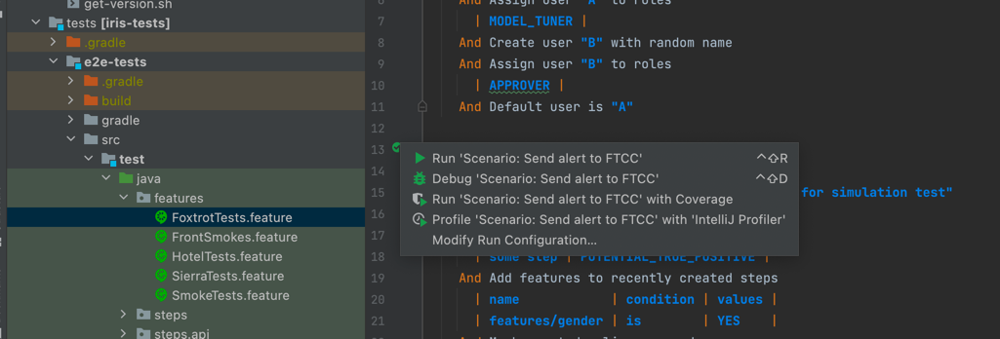

# Running tests from IDE

## First we deploy custom environment

Please refer to this [README.md](../../kubernetes/README.md) before proceding (to install required apps)

```bash
#!/bin/bash
#
# Copyright (c) 2022 Silent Eight Pte. Ltd. All rights reserved.
#
NAMESPACE=$1
CHART=sear
ENVIRONMENT=$2
REL=pp-tst-$ENVIRONMENT
FULL_REL=$REL-$CHART
HELM_SECRETS_DRIVER=vals helm secrets \
  upgrade \
  --install \
  --namespace $NAMESPACE \
  --create-namespace \
  --values values.core.yaml \
  --values values.ingress-internal.yaml \
  --values values.$ENVIRONMENT.yaml \
  --set keycloak.ingress.hostname=$FULL_REL-$NAMESPACE.prv.dev.s8ops.com \
  --set keycloak.externalDatabase.host=$FULL_REL-postgres.$NAMESPACE.svc \
  --set keycloak.externalDatabase.existingSecret=keycloak.$FULL_REL-postgres.credentials.postgresql.acid.zalan.do \
  --wait \
  --timeout 15m \
  $REL \
  ../charts/$CHART
```

The base url will be `$FULL_REL-$NAMESPACE.prv.dev.s8ops.com`

## we can now run individual tests but setting IDE context:


(all other required parameters are currently embedded in the source code of e2etests as default values)

## run cucumber tests:


