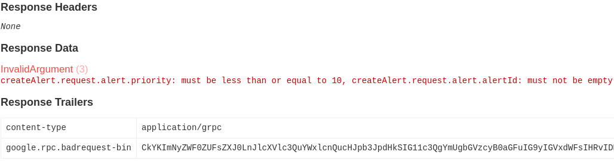

# Validation Guide

The gRPC on its own has no built-in validation, at least not for Java.
Because of that, we're using [Bean Validation](https://beanvalidation.org/) (and [Hibernate Validator](https://hibernate.org/validator/) in particular) to implement validation of requests.

Due to the gRPC code being generated during compilation, there is no way to include Bean Validation annotations in it, therefore we're using constraint mappings via the XML.

This guide shows you how to easily add validation of the Protocol Buffer messages in the gRPC services.

> **IMPORTANT**
>
> The validation is for validating **input** data, do not validate fields with option `(google.api.field_behavior) = OUTPUT_ONLY`.

[[_TOC_]]

## Adding validation to the module

To add validation support to the module:

1.  Create an XML file with constraint mappings in the directory `<module-dir>/src/main/resouces/META-INF/validation`, e.g., `adjudication-engine-alerts/src/main/resources/META-INF/validation/alerts-validation.xml`, with the following content:
    ```xml
    <?xml version="1.0" encoding="UTF-8"?>
    <constraint-mappings
      xmlns="http://xmlns.jcp.org/xml/ns/validation/mapping"
      xmlns:xsi="http://www.w3.org/2001/XMLSchema-instance"
      xsi:schemaLocation="http://xmlns.jcp.org/xml/ns/validation/mapping
                          http://xmlns.jcp.org/xml/ns/validation/mapping/validation-mapping-2.0.xsd"
      version="2.0">
      <default-package>com.silenteight.adjudication.api.v1</default-package>
    </constraint-mappings>
    ```
    **Make sure there are no other constraint mapping files with the same name in the project,** because the mappings are loaded from classpath.
    > **NOTE**
    >
    > The file name shall correspond with the name of the module, e.g., module `adjudication-engine-alerts` has constraints defined in the file `alerts-validation.xml`.
    > For the very large files, use your best judgement as to how to split it.
2.  Reference the file created above in the validation configuration in `adjudication-engine-app` module, i.e., the file `adjudication-engine-app/src/main/resources/META-INF/validation.xml`:
    ```xml
    <constraint-mapping>META-INF/validation/alerts-validation.xml</constraint-mapping>
    ```
    The file is specified by its **classpath**.
3.  Add a validation configuration file to the module test classpath, creating file `<module-dir>/src/test/resouces/META-INF/validation.xml`. For an example of such a file, take a look at [the example](../adjudication-engine-alerts/src/test/resources/META-INF/validation.xml).
4.  Add the necessary dependencies to `build.gradle`:
    ```groovy
    aspect libraries.silenteight_sep_base_aspects
    compileOnly libraries.spring_web
    compileOnly libraries.spring_tx
    testImplementation libraries.hibernate_validator
    testImplementation libraries.tomcat_embed_el
    ```

Once the module is ready, follow up with setting up the validation of the Protocol Buffer messages.

## Configuring validation of Protocol Buffers

The [Mapping constratins via `constraint-mappings`](https://docs.jboss.org/hibernate/validator/6.2/reference/en-US/html_single/#section-mapping-xml-constraints) documentation gives an overview of possibilities for configuring validation via the XML file.

Configuring validation for Protocol Buffer messages is somewhat tricky, due to the code being generated, and there are implementation details that need to be taken into account when configuring validation.

For the rest of this section, the following example message will have validation configured:

```proto
syntax = "proto3";

message ValidationExample {
  int32 positive_integer = 1;
  string short_string = 2;
  InnerMessage inner_message = 3;
  repeated Element elements = 4;
}

message InnerMessage {
  int32 nonnegative_integer = 1;
}

message Element {
  string required_string = 1;
}
```

Once properly configured, gRPC services will validate the requests, returning informative error messages:



The class responsible for generating such an error is [ValidationGrpcExceptionHandler](../adjudication-engine-common/src/main/java/com/silenteight/adjudication/engine/common/grpc/ValidationGrpcExceptionHandler.java), using [Richer error model](https://grpc.io/docs/guides/error/#richer-error-model), documented in the gRPC error handling guide.

### Declaring bean for validation

To specify constraints, you need to declare in which class these constraints must be applied.
To do so, add `<bean>` elements:

```xml
<bean class="ValidationExample">
</bean>

<bean class="InnerMessage">
</bean>

<bean class="Element">
</bean>
```

> **NOTE**
>
> The classes can be specified by a simple class name, if they belong to the same package as specified by `<default-package>` tag, or by a full class name.

### Validating primitive fields (except strings)

To validate primitive fields (except strings), use the `<field>` constraint.

The name of the field is `camelCased` name of the message field, suffixed with `_`, e.g., `positive_integer` is `positiveInteger_`.

```xml
<field name="positiveInteger_">
  <constraint annotation="javax.validation.constraints.Min">
    <element name="value">1</element>
  </constraint>
</field>
```

If in doubt, inspect the generated class code to get the name of the field.

### Validating string fields

To validate string fields, use the `<getter>` mapping.
This is required, because string fields are generated with an `Object` class, instead of `String`, yet the generated getter is of type `String`.

The name of the getter is `camelCased` name of the message field, e.g., `short_string` -> `shortString`.

```xml
<getter name="shortString">
  <constraint annotation="javax.validation.constraints.NotEmpty"/>
  <constraint annotation="javax.validation.constraints.Size">
    <element name="max">100</element>
  </constraint>
</getter>
```

### Validating inner messages

To validate fields holding inner messages, use the `<field>` mapping.
This is required to check for existence of the field, because getters never return `null`, and `null` indicates that the field never arrived in the message.
Setting validation on the field and adding `NotNull` constrain works effectively as `has<FieldName>()` call.
In the example below, the validation fails when `ValidationExample.hasInnerMessage` returns false.

> **NOTE**
>
> To enable validation of inner message (or messages in the list), you need to add `<valid/>` tag to the constraint definition.

```xml
<field name="innerMessage_">
  <valid/>
  <constraint annotation="javax.validation.constraints.NotNull"/>
</field>
```

### Validating repeated fields

To validate repeated fields, use the `<field>` mapping, but using `<getter>` would work as well.
Using `<field>` helps with the error messages, as the field name returned is similar to the one definied in .proto file, whereas the getter is appended with `List`, e.g., `getElementsList`.

Using `<field>`:

```xml
<field name="elements_">
  <valid/>
  <constraint annotation="javax.validation.constraints.NotEmpty"/>
</field>
```

```xml
<getter name="elementsList">
  <valid/>
  <constraint annotation="javax.validation.constraints.NotEmpty"/>
</getter>
```

### Full example of bean validation XML

Below is an example of constraint definitions for `ValidationExample` message.

```xml
<bean class="ValidationExample">
  <field name="positiveInteger_">
    <constraint annotation="javax.validation.constraints.Min">
      <element name="value">1</element>
    </constraint>
  </field>
  <field name="innerMessage_">
    <valid/>
    <constraint annotation="javax.validation.constraints.NotNull"/>
  </field>
  <field name="elements_">
    <valid/>
    <constraint annotation="javax.validation.constraints.NotEmpty"/>
  </field>
  <getter name="shortString">
    <constraint annotation="javax.validation.constraints.NotEmpty"/>
    <constraint annotation="javax.validation.constraints.Size">
      <element name="max">100</element>
    </constraint>
  </getter>
</bean>
```

## Enabling validation in a gRPC service

To enable validation you have to extract the implementation of the gRPC service to separate class, because Bean Validation disallows validating derived method calls, when super class method has no validation annotations.
Once extracted, you can decorate the implementation method parameters with `javax.validation.Valid` annotation.

In example, having the following gRPC service method:

```java
public void createAlert(
      CreateAlertRequest request, StreamObserver<Alert> responseObserver)
```

the implementation of this method might look like this:

```java
@Override
public void createAlert(
    CreateAlertRequest request, StreamObserver<Alert> responseObserver) {
  
  var response = alertService.createAlert(request);
  
  responseObserver.onNext(response);
  responseObserver.onCompleted();
}
```

and the following method declared in `alertService`:

```java
Alert createAlert(@Valid CreateAlertRequest request)
```

This way, the `request` will be validated according to constraints configured for the `CreateAlertRequest` type.
