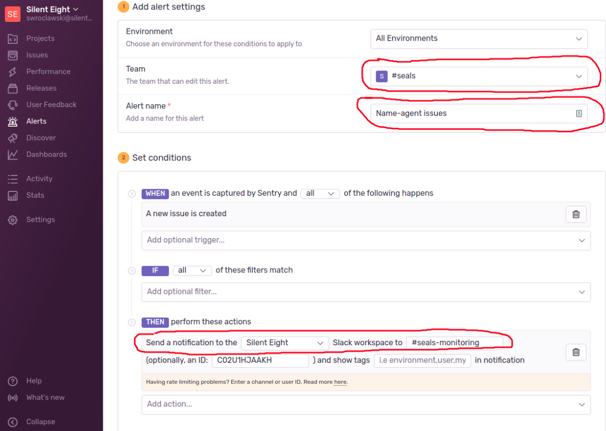

# Intro to Sentry

# Business context

Mail from Andrew Haczewski:

<p>
Dear All,

You know there are a lot of challenges we, as a technology team, are dealing with lately. 
This is to address one of them: proactively acting on issues in our software, 
instead of being told about the issue and having to react.

To be proactive in finding issues requires constant monitoring of our applications deployed in our infrastructure - be it production deployment for a customer (like the one for SVB), or our own lab/development environments. For example, imagine the Whiskey team working on the migration from Elasticsearch to PostgreSQL, unconsciously triggering exceptions in Governance - they would not know something broke in Governance if they had not looked in the log files. And I know I am not always looking for other service errors unless the service I am working on breaks as well.

The situation is hugely amplified when the errors are discovered by our customers. Personally, I think it is a shame for us all that the customer has to tell us something is broken.

But that changes today.

What I ask of you is to integrate your application with Sentry.io, which is a service for gathering events from applications, grouping them, and notifying your team according to alerting policies you define.
</p>

## How to configure Sentry?

- Each team member should log in into https://sentry.io/organizations/silent-eight/ with ones Google account and join SEALS team
- If you want to integrate another service you have to first create a new project (most likely Spring Boot application) and then follow the instructions.
  - Example: https://sentry.io/settings/silent-eight/projects/name-agent/install/java-spring-boot/


- Configure alert and notifications rules in Sentry (Alerts -> alerts per project)


Remove default alert configuration (sending email) and change it to the below (slack integration): 




## How to integrate Sentry with our services

### Agent-commons
Sentry dependencies were added to `agent-commons` to separate module `agent-monitoring` which acts like an abstraction to any services connected for monitoring. This is the only component that will know about sentry existence in agents ecosystem.

`Agent-monitoring` exposes Spring configuration that needs to be added to Spring apps to create a Monitoring bean on startup. Monitoring via Sentry is only created if proper configuration in Spring app properties is present.

`Agent-commons` publish this dependency as api platform, which means other components will reuse the version specified in agent-commons/agent-monitoring/build.gradle.


### Agent-facade and agents
Other components have additional dependency:

```gradle
// S8 monitoring
api libraries.s8_agents_monitoring
```


### Configuration
Each Spring component that want to start using Monitoring bean has to provide additional parameters

```properties
sentry.enabled=true
sentry.dsn=
sentry.environment=unknown
sentry.traces-sample-rate: 0
```

- **sentry.enabled** - has to be set to “true” for a bean to be created, otherwise it will log exceptions using log.error
- **sentry.dns** - always empty in the component, this value should be update in deployment descriptor (see config below)
- **sentry.environment** - by default set to “unknown”. This is to override sentry own default value which is “production” and would be misleading
- **sentry.traces-sample-rate** - should be set to 0 to prevent sentry from gathering performance metrics.


## Usage

To use Sentry monitoring you need to add `MonitoringModule.class` to agent configuration so Spring can create a proper bean on a startup, then inject it in the class where you want to use monitoring.

Example:

```java
@SpringBootApplication(scanBasePackageClasses = {
MonitoringModule.class
})
```

Monitoring interface accepts only one value and this is an Exception.

```java
monitoring.captureException(error);
```

## Production configuration
Each internal environment or production deployment will have separate configuration.

In helm charts we need to specify values to override default properties values added in agents.

One way to do it is to add in `helm-charts-for-agent`

Example:
```
name-agent/helm-chart/templates/deployment.yaml
```

```
args: ["name",
       "--logging.config=file:/etc/logback.xml",
       "--grpc.client.data-source.address={{ .Values.grpc.client.datasource.address }}",
       "--sentry.dsn=https://423d3bd99f14476dbf7354cbd584cc57@o1129201.ingest.sentry.io/6176119", 
       "--sentry.environment=unknown",
       "--sentry.enabled=true"
 ]
```

When setting up helm-charts for internal environments we should change value `sentry-environment` to the same names as environment name or distribution name (`sierra-ts` or `hotel-ns`)


