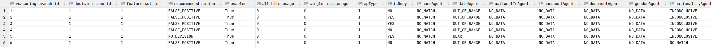

= HLD #17

- Reference ticket: *TBD*
- Reason: As a BO, I want to receive an Reasoning Branch Scorer report with information about steps.

[plantuml,bo-generates-rbs,svg]
-----
@startuml
header Generate RBS

box "REST"
    participant API
end box

box "Governance" #LightBlue
    participant backend
    participant db
end box

API -> backend : Generate RBS for policy id

note over backend, db
    if no Policy Id set, we will generate report for all policies
end note

backend -> db : Read policy with steps (solution), fv (features)
note over backend, db
    using reasoning branch table to find all connection between steps and fv
end note

backend -> API: Return Reasoning Branch Scorer report.

@enduml
-----

.rbs.csv

