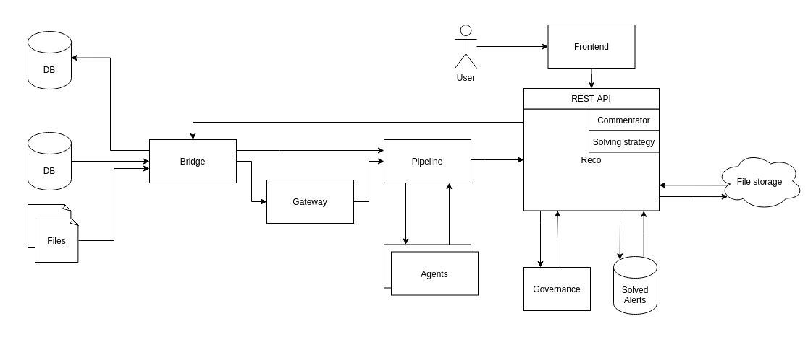

= HLD #26

== Simulator MVP

- Reference ticket: TBA
- Reason:
We want to introduce an MVP version of the simulator.
We will add functionality to the Reco service and in the future, after extraction of `Commentator` and `Strategy Solver` we will rename Reco to Simulator.

== Alert Solving and Simulation Process
[plantuml,alert-solving-and-simulation-process,svg]
-----
@startuml
header Alert Solving and Simulation Process

actor user

participant Frontend as f

participant Reco as reco

database "processed alerts" as db

participant RabbitMQ as queue

participant "File Storage" as fs

participant Governance as gov

participant Pipeline as pipeline

participant Bridge as bridge

== Data preparation ==

bridge -> pipeline : alert to solve
pipeline -> reco : processed alert
reco -> reco : generate UUID for alert in specific version
reco -> db : store alert reason with metadata \n(country / date / watchlist / etc)
reco -> bridge : solved alert

== Prepare dataset ==

user -> f : set dataset \n(name + period)
f -> reco : set dataset \n(name + period)
reco -> queue : store dataset
...
queue -> reco : read dataset
reco -> db : query alerts
db -> reco : list of alerts UUID
reco -> db : save dataset \n(dataset name + list of alerts UUID)

== Prepare simulation ==

user -> f : read a list of datasets
f -> reco : read list of datasets
reco -> db : get list of datasets
db -> reco : list of datasets
reco -> f : list of datasets
f -> reco : read list of policies
reco -> db : get list of policies
db -> reco : list of policies
reco -> f : list of policies
...
user -> f : run simulation \n(dataset + policy)
f -> reco : run simulation
reco -> db : store requested simulation \nwith state __TO_DO__
db -> reco : simulation id
reco -> queue : request simulation (simulation id)
reco -> f : simulation id

== Simulation ==

queue -> reco : read requested simulation id
reco -> db : store requested simulation \nwith state __IN_PROGRESS__
reco -> db : read alerts UUID for dataset
reco -> db : read alerts
db -> reco : alerts for simulation
reco -> gov : solve matches (FV) with selected policy
gov -> reco : matches solutions
reco -> reco : alert solution based on strategy
reco -> reco : generate comment
reco -> reco : prepare reports for simulation
reco -> fs : store reports
fs -> reco : simulation reports url
reco -> db : save simulation report for simulation id
reco -> db : change simulation status to __READY__
reco -> queue : ack requested simulation

== Read results ==

user -> f : read simulations
f -> reco : read simulations
reco -> db : read simulations
db -> reco : simulations with status
reco -> f : simulations with status
user -> f : open simulation
f -> reco : read simulation data
reco -> db : read simulation data
db -> reco : simulation status, dataset, policy, \nstatistics, reports urls
reco -> f : simulation status, dataset, policy, \nstatistics, reports urls
f -> fs : download reports

@enduml
-----

== Simulation Process - next step
[plantuml,simulation-process-next-step,svg]
-----
@startuml
header Simulation Process - next step

actor user

participant Frontend as f

participant Simulator as sim

database "processed alerts" as db

participant RabbitMQ as queue

participant "File Storage" as fs

participant Commentator as com

participant Governance as gov

participant Pipeline as pipeline

participant Bridge as bridge

== Simulation ==

queue -> sim : read requested simulation
sim -> db : store requested simulation \nwith state __IN_PROGRESS__
db -> sim : simulation id
sim -> db : read alerts UUID for dataset
sim -> db : read alerts
db -> sim : alerts for simulation
sim -> bridge : **order missing alerts processing**
sim -> gov : solve matches (FV) with selected policy
gov -> sim : matches solutions
sim -> gov : **alert solution based on strategy**
sim -> com : **generate comment**
sim -> sim : prepare reports for simulation
sim -> fs : store reports
fs -> sim : simulation reports url
sim -> db : save simulation report for simulation id
sim -> db : change simulation status to __READY__

@enduml
-----

== Pros

. Fast development.
. MVP delivered on time.
. Evolution not revolution.
. More time to prepare a proper solution (for both simulation and solving).

== Cons

. We might end up in a dead-end.
. We may not have time to come up with the right solution.
. Solution good enough for MVP but not good enough as a target.

== Alert Solving and Simulation Process - simplified
[plantuml,alert-solving-and-simulation-process-simplified,svg]
-----
@startuml
header Alert Solving and Simulation Process

actor user

participant Simulator as reco

participant RabbitMQ as queue

participant "File Storage" as fs

participant Governance as gov

database "alerts" as db

participant Store as store

participant Pipeline as pipeline

participant Bridge as bridge

== Data preparation ==

bridge -> pipeline : alert to solve
bridge -> store : alert to solve
store -> store : generate UUID for alert in specific version
store -> db : store alert reason with metadata

== Prepare dataset ==

user -> store : set dataset
store -> db : query alerts
db -> store : list of alerts UUID
store -> db : save dataset \n(dataset name + list of alerts UUID)

== Prepare simulation ==

user -> store : read list of datasets
store -> user : list of datasets
user -> reco : get list of available configurations (policy, configuration, etc.)
reco -> user : available configurations
...
user -> reco : run simulation \n(dataset + eg. policy)
reco -> db : store requested simulation
reco -> queue : request simulation

== Simulation ==

queue -> reco : read requested simulation
reco -> queue : running simulation
queue -> store : running simulation
store -> queue : send alerts for selected dataset
queue -> pipeline : process alerts with selected configuration
pipeline -> queue : processed alerts
queue -> reco : read processed alerts
reco -> gov : solve matches (FV) with selected policy
gov -> reco : matches solutions
reco -> reco : alert solution based on strategy
reco -> reco : generate comment
reco -> reco : prepare reports for simulation
reco -> fs : store reports
fs -> reco : simulation reports url

== Read results ==

user -> reco : read simulations
reco -> user : simulations with status
user -> reco : read simulation data
reco -> user : simulation status, dataset, policy, \nstatistics, reports urls
user -> fs : download reports

@enduml
-----
