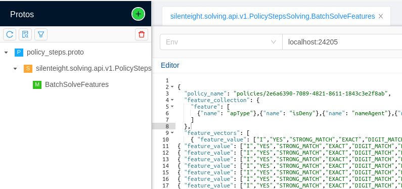

[TOC levels=2-4 numbered]: # "Governance"

# Governance
1. [Prerequisites](#prerequisites)
1. [Development Setup](#development-setup)
   1. [Starting Database](#starting-database)
   1. [Starting RabbitMQ from SERP](#starting-rabbitmq-from-serp)
   1. [Configuring RabbitMQ for Governance](#configuring-rabbitmq-for-governance)

> **NOTE**
>
> Governance has been moved from SERP module to a dedicated Git repository and included in SERP as a dependency.

## Prerequisites

Before you start working on the project, you need to install few prerequisites.

|    Prerequisite    | Necessity | Remarks                                                                                                                                                                                                                                     |
|:------------------:|:---------:|:--------------------------------------------------------------------------------------------------------------------------------------------------------------------------------------------------------------------------------------------|
|    **Java 11**     | Mandatory | The project uses Java 11, you can [download easy to install packages for your system from Azul Systems, Inc.]( https://www.azul.com/downloads/zulu-community/?&version=java-11-lts); make sure you install full Java Development Kit (JDK). |
|     **Docker**     | Mandatory | Running integration tests requires Docker; infrastructural services also use Docker, which greatly simplifies development setup.                                                                                                            |
|    **IntelliJ**    | Mandatory | The project is prepared for development in the IntelliJ IDEA, so you have to have a license for yours.                                                                                                                                      |
| **Docker Compose** | Mandatory | Docker Compose is used to simplify setting up required infrastructural services for development.                                                                                                                                            |
|      **gdub**      | Optional  | That is a helper script for running nearest gradle wrapper. [Download it from GitHub](https://github.com/dougborg/gdub) and follow instructions for installing.                                                                             |
|      **jEnv**      | Optional  | jEnv helps with managing Java versions. [Download it from jEnv site](https://www.jenv.be/) and follow instructions for installing.                                                                                                          |
|     **Gradle**     | Optional  | The project comes with the gradle wrapper that you should use for building the project. Nevertheless, you might want to have Gradle installed.                                                                                              |

> **NOTE**
>
> All paths in this document are relative to the root project directory.

## No REST API - no Keycloak

Sometimes there is a need to block all endpoints (HSBC on a prod env).
To do this, you can run the application with a `no-rest-api` profile.
All endpoints will be available with a basic-auth, but there will be no user available to log in.

With this profile, the application doesn't require Keycloak's adapter properties to boot. 

## Development Setup

Before you can run Governance, you have to have a few infrastructural services running:

1. PostgreSQL - the database for persisting data,
2. RabbitMQ - the message broker for communicating between components and with outside services.

### Starting Database

Start database service using the command:

    ./scripts/run-services.sh

> **NOTE**
>
> The above command runs `docker-compose` in compatibility mode (the `--compatibility` argument).
> This is required to limit the amount of memory to services, otherwise it would be impossible to start all the services on regular developer's computer.

### Starting RabbitMQ 
Governance uses RabbitMQ message broker to communicate with other components.

To start RabbitMQ, follow the steps:

1. Clone [Common Docker Infrastructure]:

       git clone https://gitlab.silenteight.com/sens/common-docker-infrastructure
       
1. Start docker-compose. It is sufficient to start just the rabbitmq service.
    
       docker-compose up -d rabbitmq

### Using Swagger UI
By default, swagger is disabled in production. To enable it you need to apply `swagger` Spring Boot profile.
UI available under [link](https://localhost:24204/rest/governance/openapi/swagger-ui/index.html?configUrl=/rest/governance/openapi/api-docs/swagger-config).

In order to make authenticated requests add a `basic-auth` profile and fill sep.auth.basic.users property.

```yaml
sep.auth.basic.users:
  - username: bo
    password: bodev
    roles:
      - MODEL_TUNER
  - username: ap
    password: apdev
    roles:
      - APPROVER
```


## Helpers

### Import policy

Policy example is available in the `helpers/policy/example/solid-steps.json` file.
This example reflects solid steps created by Victor.

You can run `Governance - development environment` configuration and use [Swagger](http://localhost:24204/rest/governance/openapi/swagger-ui/index.html?configUrl=/rest/governance/openapi/api-docs/swagger-config#/import-policy-rest-controller/importPolicy) to make a test call.
You have to use `/api/v1/policies/import` endpoint and JSON file as an input.
In the `development environment`, you have configured basic auth with an user (`bo`) and password (`bodev`). 

The policy is imported in `in_use` state, which means it will be used to solve any request made by GRPC API.

You can import a policy from JSON file with or without UUIDs in steps and in the policy.
If you provide UUIDs in the `policyId` and the `stepId` fields, then those ids will be used when saving the policy in the database, otherwise, those ids will be generated.

### Solve Feature Vector GRPC call

You can use BloomRPC to make a test call to the Governance to solve Feature Vector.


You can use `helpers/fvsolve/example/1023-fv.json` file as an input in the editor.
