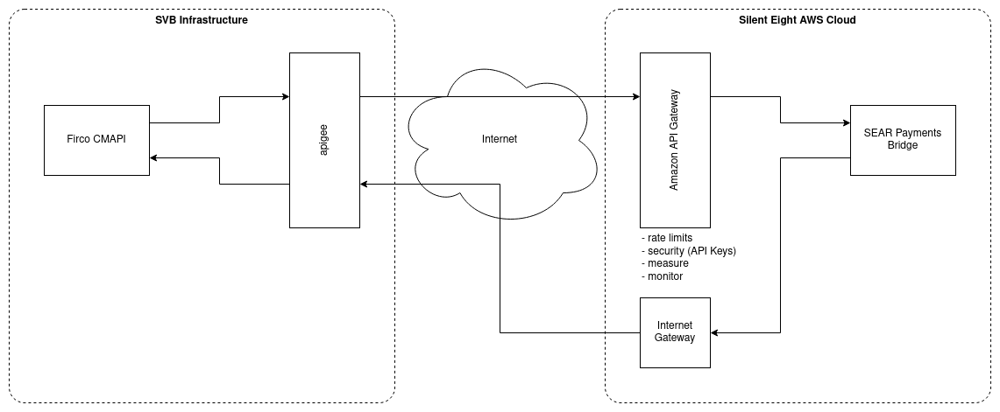

# ADR 0001: System design

## Goal

Payment Bridge integrates Firco Continuity (via CMAPI) with AE and the rest of solving services to solve real-time payment screening alerts.

## External systems

- Firco Continuity - for retrieving alerts and sending back recommendations
- Adjudication Engine - for generating alert recommendations
- Governance - for retrieving current model

## SVB Integration

## Input interfaces

- CMAPI (HTTP)
  - `/ContinuitySendMessage (msg_SendMessage)` HTTP endpoint - Payments Bridge receives alert from CMAPI
- AE (AMQP)
  - `RecommendationsGenerated` message
- Data Source (gRPC)
  - Agent features
  - Categories and their values
  - Comment inputs
- Governance (AMQP)
  - `ModelPromotedForProduction` message

## Output interfaces

- CMAPI (HTTP)
  - `/ContinuityReceiveService (msg_ReceiveDecision)` HTTP endpoint - Payments Bridge sends alert recommendation and status transition back to CMAPI
- AE (gRPC)
  - `AlertService` gRPC service
  - `DatasetService` gRPC service
  - `AnalysisService` gRPC service
  - `RecommendationService` gRPC service
- Governance (gRPC)
  - `SolvingModelService` gRPC service

## Data flow

TODO: add diagrams from Draw.io once ready

### Receiving alerts from CMAPI

Example case:

1. CMAPI - received 3 alerts
2. RecommendationsGenerated - received 2 recommendations, send out 2 alert recommendations to CMAPI
3. RecommendationsGenerated - received 1 recommendation, send out 1 alert recommendations to CMAPI

## Modules

### sear-payments-bridge-datasource

- Implements Data Source API gRPC services
  - NameInputService
  - LocationInputService (for Geo Agent)
  - CategoryService
  - CommentInputService
- Internal API for getting data that will get served by Data Source API (a.k.a. ETL API)
  - This API is going to be used by Firco CMAPI integration
- Receiving, storing and sharing features, category values and comment inputs, in a format easy to query via Data Source API, e.g., `NameFeatureInput` from `NameInputService`, or `CategoryValue` from `CategoryService`.

### sear-payments-bridge-firco

- Implements controller for `/ContinuitySendMessage` HTTP endpoint to receive alerts
- Implements decision submission to `/ContinuityReceiveService` HTTP endpoint to provide alert recommendation
- Tracks messages and their association with alerts in AE
- Handles paired alerts
- Performs mapping of recommended action to Firco status
- Receiving and transforming the data from `msg_SendMessage` into alerts, matches, features, categories, and comment inputs.
- Sending back the `msg_ReceiveDecision` for each generated recommendation.

### sear-payments-bridge-ae

- Registers alerts and matches in AE
- Manages and tracks analysis and datasets in AE
- Receives from AE and passes back to Firco the recommendation

### sear-payments-bridge-governance

- Manages current model from Governance

## THINGS NOT CONSIDERED

- Integration with Warehouse for reporting purposes
- Learning from CSV files delivered by SVB
- Learning from SCB
