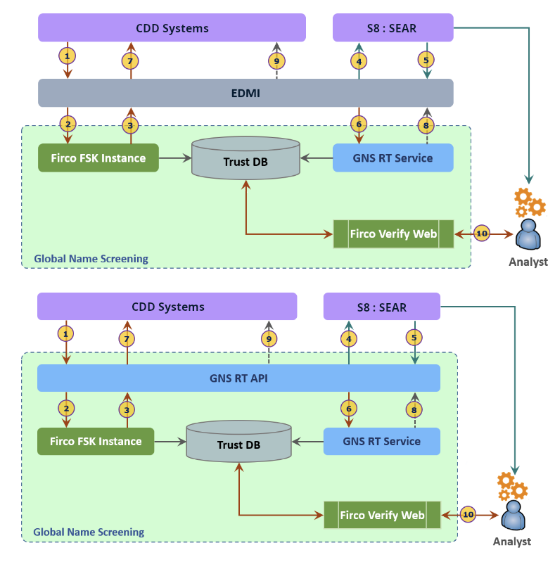
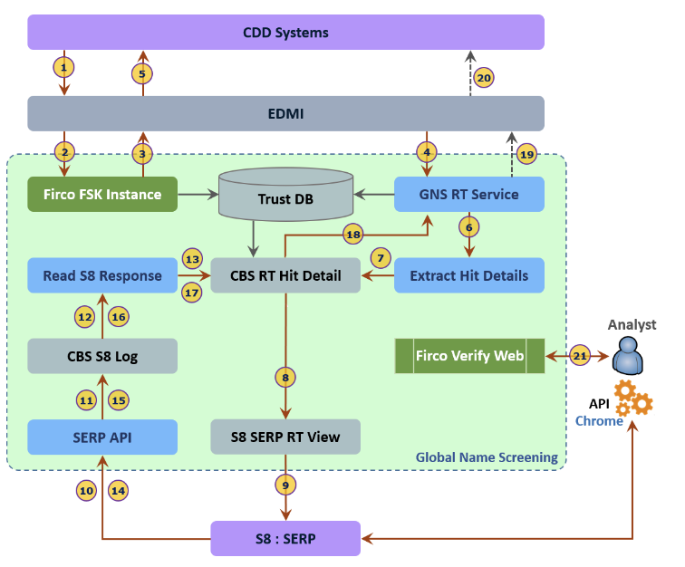

= Architecture

.Realtime integration of GNS Realtime

.High-level Flow
* Enterprise Data Management Interface (EDMI) on receipt of screening request from Customer Due Diligence (CDD) system, integrates with separate Firco Screen & Keep (FSK) instance for Deny, PEP and AM screening.
* EDMI receives Potential Match or No Match information along with Alert & Hit details from individual FSK instance.
* EDMI consolidates the Deny, PEP and AM alerts (including Hit details) and makes the real-time synch call to S8 passing the consolidated Alert and Hit details.
* Silent Eight process all Alerts (Deny, PEP and AM) and provides the consolidated single response to EDMI consisting of recommended status and comment for each Alert (recommendation is at Alert level).
* EDMI prepares the initial response for CDD systems, sends a copy to GNS RT.
* EDMI sends the initial response to CDD system.

.Near Real-time integration of GNS Realtime

.High-level Flow
* EDMI on receipt of screening request from CDD system, integrates with separate FSK instance for Deny, PEP and AM screening.
* EDMI receives Potential Match or No Match information along with Alert & Hit details from individual FSK instance.
* EDMI consolidates the Deny, PEP and AM alerts (including Hit details), prepares the initial response for CDD systems, sends a copy to GNS RT.
* GNS-RT calls the CBS process to extract the Hits and make the Alert available to Silent Eight.
* Silent Eight service reads the individual Alert separately and provides the recommendations (Status & Comments at Alert level) back to CBS.
* GNS-RT service monitoring the CBS, reads the recommendations, prepares the final response for CDD system and sends to EDMI which in-turn sends to CDD system.
