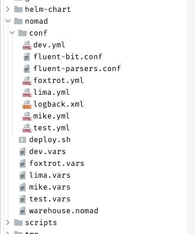
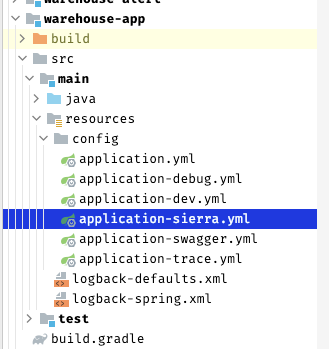
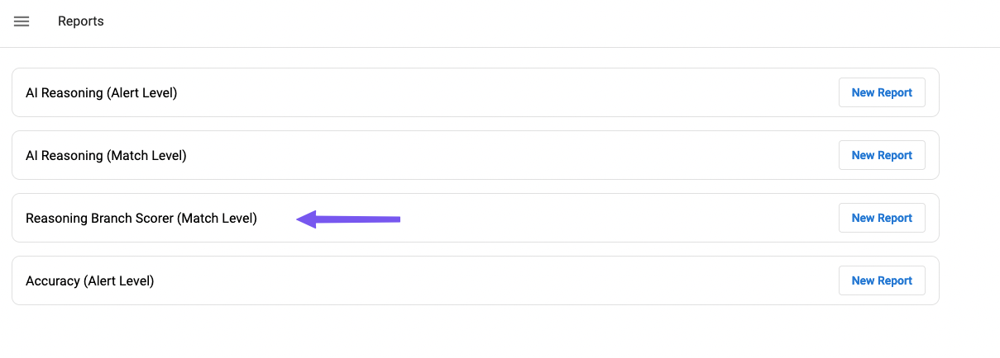
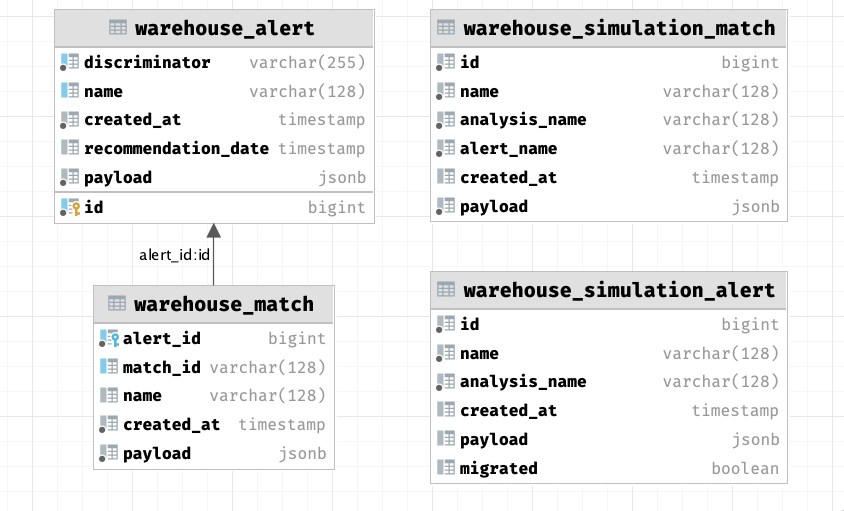
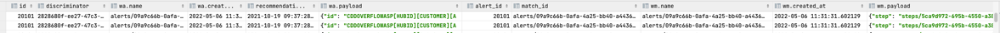
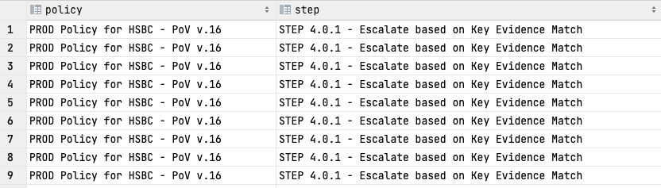

== Assumptions

In warehouse application, our presupposition is to rely on configuration as much as it is possible,
therefore creating/adjusting/removing reports does not impact on code and does not need any changes there.

=== Creating reports

---

- Configuration file

---

Configuration is dependent on the client, so first, you need to select proper
*.yaml* file.

When the application is deployed on nomad then go to: $ cd *nomad/conf*

Alternatively, the configuration could be found in the *warehouse-app* module, for ex. AWS environment.

[#img-conf]
.Nomad conf directory

[#img-conf2]
.location of AWS env config file

___

- Structure of configuration

---

All reports are under the *warehouse.report.v2.reports* property

To create a new report, simply what's need to be done:

* [*] find correct *.yml* configuration file
* [x] go to proper configuration property
* [x] create new entry which consist of (_name, type, description, selectSqlQuery_) attributes

=== Example report
:source-highlighter: coderay

[source%linenums,ruby]
----
warehouse.reports.v2:
  reports:
    - name : RB_SCORER  <1>
      type: production <2>
      description: Reasoning Branch Scorer (Match Level) <3>
      selectSqlQuery > <4>
        SELECT wa.name                                             AS "S8 Alert ID",
          wsm.payload ->> 'clientMatchId'                          AS "Client Match ID",
          wsm.payload ->> 'match_reason:policy'                    AS "Policy ID",
          wsm.payload ->> 'match_reason:policy_title'              AS "Policy Name",
          wsm.payload ->> 'match_reason:step'                      AS "Step ID",
          wsm.payload ->> 'match_reason:step_title'                AS "Step Name",
          wsm.payload ->> 'match_reason:feature_vector_signature'  AS "Reasoning Branch ID",
          wsm.payload ->> 'categories/hitType:value'               AS "Watchlist Type",
          wsm.payload ->> 'match_solution'                         AS "S8 Hit Resolution",
          wsa.payload ->> 'recommendation_comment'                 AS "S8 Match Reason",
          wsa.payload ->> 'recommendation_recommended_action'      AS "S8 Alert Resolution"
        FROM warehouse_simulation_alert wsa
        JOIN warehouse_alert wa ON wsa.name = wa.name
        JOIN warehouse_simulation_match wsm ON wsm.alert_name = wsa.name
        WHERE wsa.analysis_name = 'analysis/${analysisId}'
          AND wsm.analysis_name = 'analysis/${analysisId}'

    - name: next report name
      type: next report type
      description: next descrption
      selectSqlQuery:
        SELECT * FROM dual

----

1. The value that will be in the file name
2. As we support _production_ and _simulation_ reports, one of them should be there
3. The value that will appear in our FE application as "Report name"
---
[#img-conf]

---
4. Output of this query should be identical to values that appear in the report file.
There is the possibility to pass parameters into query see. *21/22* file of <<Example report>>.
The parameter should be stored in placeholder *${}* for supported placeholders go to <<Query placeholders>>

:icons: font
NOTE: query should not end with *;* this will cause an exception in our application

=== Display on UI

To have reports available on UI, there is no more work to be done besides that configuration entry
needs to be added/removed/modified

FE fetches available reports from our configuration file, this is done by API what is exposed:

  /api/v2/analysis/{type}/reports:
    get:
      summary: "GET api/v2/analysis/{type}/reports"
      operationId: "getAvailableReports"
      parameters:
      - name: "type"
        in: "path"
        required: true
        schema:
          type: "string"
      responses:
        "200":
          description: "OK"

where *{type}* is production / simulation.

:icons: font
NOTE: if something is missing on FE side, please check response using this endpoint

=== Database structure

[#img-tables]
.Main database report tables

1. _warehouse_alert_ and _warehouse_match_ - those table represents production data
2. _warehouse_simulation_ and _warehouse_simulation_match_ - represents simulation data flow

__1 Alert could have N __matches and joining tabels should look like:

[source,sql]
----
SELECT *
FROM warehouse_alert wa
    JOIN warehouse_match wm ON wa.id = wm.alert_id
----

[#img-query]
.Production alert with matches

___

Similar behaviour we could observe in simulation table

1 Simulation alert could have N matches - but be careful here

CAUTION: same alert and match could be used in few simulations, so there is need to filter them based on *analysisId*!
See line 4,5 in example below.

[source%linenums,sql]
----
SELECT *
FROM warehouse_simulation_alert wsa
  JOIN warehouse_simulation_match wsm ON wsa.name = wsm.alert_name
WHERE wsa.analysis_name = 'analysis/${analysisId}'
  AND wsm.analysis_name = 'analysis/${analysisId}'
----

In simulation reports, there is the possibility to join production alerts and matches. If a report needs to contain additional data from those tables be careful and pay attention to how tables should be connected to avoid data inconsistency

* simulation alert -> production alert
* simulation match -> production match

[source%linenums,sql]
----
SELECT *
    FROM warehouse_simulation_alert wsa
       JOIN warehouse_simulation_match wsm ON wsa.name = wsm.alert_name
       LEFT JOIN warehouse_alert wa ON wsa.name = wa.name
       LEFT JOIN warehouse_match wm ON wsm.name = wm.name
WHERE wsa.analysis_name = 'analysis/${analysisId}'
  AND wsm.analysis_name = 'analysis/${analysisId}'
----

The most interesting data, is stored in *payload::jsonb* column, this column occurs in all mentioned previously tables :

* warehouse_alert
* warehouse_match
* warehouse_simulation
* warehouse_simulation_match

:source-highlighter: pygments

===== exmaple of warehouse_alert.payload
[source,json]
----
{
  "id": "CDDOVERFLOWASP[HUBID][CUSTOMER][AAAGLOBAL165R1089]:ID:GG-ESCION-EX:20200212011",
  "policy": "policies/3f1432f4-8828-478e-a6b4-8803ba80be2b",
  "status": "ERROR",
  "comment": "S8 recommended action: Manual Investigation GR-ISAN 2868757",
  "policyId": "policies/c13b2278-f0d5-4366-a40f-576a3fb4f5a3",
  "DN_CASE.ID": "12390",
  "policy_title": "PROD Policy for HSBC - PoV v.16",
  "recommendation": "Level 2 Review",
  "lastCaseComment": "test comment 2",
  "analyst_decision": "analyst_decision_true_positive",
  "s8_lobCountryCode": "PL",
  "s8_recommendation": "ACTION_POTENTIAL_TRUE_POSITIVE",
  "extendedAttribute5": "SAN",
  "recommendationDate": "2021-10-19T09:37:28.559687Z",
  "recommendationYear": "2020",
  "match_reason:policy": "policies/dcfd0d54-42d4-4b5e-b105-9f81c2b9529b",
  "recommendationMonth": "6",
  "DN_CASE.currentState": "Level 1 Review",
  "DN_CASE.modifiedDateTime": "2021-10-13T09:37:28.558647Z",
  "match_reason:policy_title": "Working policy for simulation as of 22.07.2021",
  "DN_CASE.ExtendedAttribute5": "SCION",
  "recommendation_recommended_action": "ACTION_POTENTIAL_TRUE_POSITIVE"
}
----

===== example of warehouse_match.payload
[source,json]
----
{
"step": "steps/5ca9d972-695b-4550-a383-b09311ff42e4",
"stepId": "steps/5ca9d972-695b-4550-a383-b09311ff42e4",
"step_title": "STEP 4.0.1 - Escalate based on Key Evidence Match",
"fvSignature": "qC4MMVPvDOpB/vA+hn8tM8mUgt4=",
"match_reason:step": "NO_DATA",
"categories/hitType": "PEP",
"features/name:solution": "DATA_SOURCE_ERROR",
"features/isPep:solution": "DATA_SOURCE_ERROR",
"match_reason:step_title": "NO_DATA",
"features/gender:solution": "MATCH",
"features/commonAp:solution": "NO",
"features/commonMp:solution": "NO",
"features/isTpMarked:solution": "INCONCLUSIVE",
"features/commonNames:solution": "NO",
"features/dateOfBirth:solution": "EXACT",
"features/invalidAlert:solution": "NO",
"features/isApTpMarked:solution": "DATA_SOURCE_ERROR",
"features/otherCountry:solution": "MATCH",
"features/geoResidencies:solution": "CITY_MATCH",
"features/isCaseTpMarked:solution": "INCONCLUSIVE",
"features/geoPlaceOfBirth:solution": "NO_DATA",
"features/residencyCountry:solution": "NO_DATA",
"features/nationalIdDocument:solution": "NO_DATA",
"features/nationalityCountry:solution": "NO_DATA",
"features/registrationCountry:solution": "NO_DATA",
"match_reason:feature_vector_signature": "4+LV6i5PjYReGqF3e9eL4Mv3TC8=",
"features/incorporationCountry:solution": "NO_DATA",
"features/logicalDiscountingDob:solution": "INCONCLUSIVE",
"features/passportNumberDocument:solution": "NO_DATA"
}
----

Postgresql offers various ways to deal with jsonb type.

Here is as example of extracting a few attributes from payload into a response
[source,sql]
----
SELECT wa.payload ->> 'policy_title' as policy,
       wm.payload ->> 'step_title' as step
FROM warehouse_alert wa
     JOIN warehouse_match wm ON wa.id = wm.alert_id
----

[#img-query2]
.Extracting jsonb column

For more usefully information, on how to operate on jsonb column please see:

:hide-uri-scheme:
https://www.postgresql.org/docs/9.6/functions-json.html

https://www.postgresql.org/docs/current/functions-array.html

=== Query placeholders

Placeholders are used to pass additional parameters into report query, see 21/22 of <<Example report>>

Supported placeholder by warehouse application:

    * from
    * to
    * analysisId
    * countries

*from* and *to* act as date-time filters in production reports

[source,sql]
----
SELECT wa.payload ->> 'policy_title' as policy,
       wm.payload ->> 'step_title' as step
FROM warehouse_alert wa
     JOIN warehouse_match wm ON wa.id = wm.alert_id
WHERE wa.recommendation_date BETWEEN TIMESTAMP '${from}' AND TIMESTAMP '${to}'
----

*countries* placeholder could act as a region filter for ex.

[source,sql]
----
SELECT wa.payload ->> 'policy_title' as policy,
       wm.payload ->> 'step_title' as step
FROM warehouse_alert wa
     JOIN warehouse_match wm ON wa.id = wm.alert_id
WHERE wa.recommendation_date BETWEEN TIMESTAMP '${from}' AND TIMESTAMP '${to}'
AND (payload ->> 's8_lobCountryCode') IN (${countries})
----

*analysisId* is used in simulation reports, to query only records which participated in a concrete simulation

[source,sql]
----
SELECT wa.discriminator                                        AS "S8 Alert ID",
       wa.payload ->> 'clientId'                               AS "Client Alert ID",
       wsm.payload ->> 'match_reason:step_title'               AS "Step Name",
       wsm.payload ->> 'match_reason:feature_vector_signature' AS "Reasoning Branch ID",
       wsa.payload ->> 'recommendation_recommended_action'     AS "S8 Hit Resolution",
       wsa.payload ->> 'recommendation_create_time'            AS "S8 Resolution Timestamp",
       wsa.payload ->> 'recommendation_comment'                AS "S8 Hit Reason"
FROM warehouse_simulation_alert wsa
  JOIN warehouse_alert wa ON wsa.name = wa.name
  JOIN warehouse_simulation_match wsm ON wsm.alert_name = wsa.name
WHERE wsa.analysis_name = 'analysis/${analysisId}'
  AND wsm.analysis_name = 'analysis/${analysisId}'
----

=== Detecting issues

.Production reports

* Verify that the list of reports in UI "Reports" tab is in line with the client speification
*  Make sure that it is possible to successfully generate all the reports for a time range that guarantees sufficient amount of data (recommended minimum is 5k alerts)
**  For each report:
*** Verify visually that there are no outstanding issues (e.g. no empty columns, no empty rows)
*** Data in the report has expected format and values
(e.g. dates have proper format, "S8 Recommendations" have valid values, "S8 Reason" contains human readable text)
*** AI reasoning (alert level) has number of rows that matches the number of alerts processed within selected time range.
*** AI reasoning (match level) has number of rows that matches the total number of matches processed within selected time range.
*** Accuracy (alert level) has number of rows that matches the number of alerts processed within selected time range and supplied with learning data
*** RB scorer's match count column total is equal to the total number of matches processed within selected time range.

.Simulation reports

* Verify that the list of reports in the simulation details is in line with the client speification
* Make sure that it is possible to successfully generate all the reports for a sample simulation (recommended minimum size is 5k alerts)
* For each report:
** Verify visually that there are no outstanding issues (e.g. no empty columns, no empty rows)
** Data in the report has expected format and values (e.g. dates have proper format, "S8 Recommendations" have valid values, "S8 Reason" contain human readable text)
** AI reasoning (alert level) has number of rows that matches the number of alerts processed as a part of the reference simulation.
** AI reasoning (match level) has number of rows that matches the total number of matches processed as a part of the reference simulation.
** Accuracy (alert level) has number of rows that matches the number of alerts processed as a part of the reference simulation and supplied with learning data
** RB scorer's match count column total is equal to the total number of matches processed as a part of the reference simulation.
* Verify that there are not outstanding issues in the "Overview" section (Total alerts count matches with the dataset size, the statistcs corresponds to expected values)
