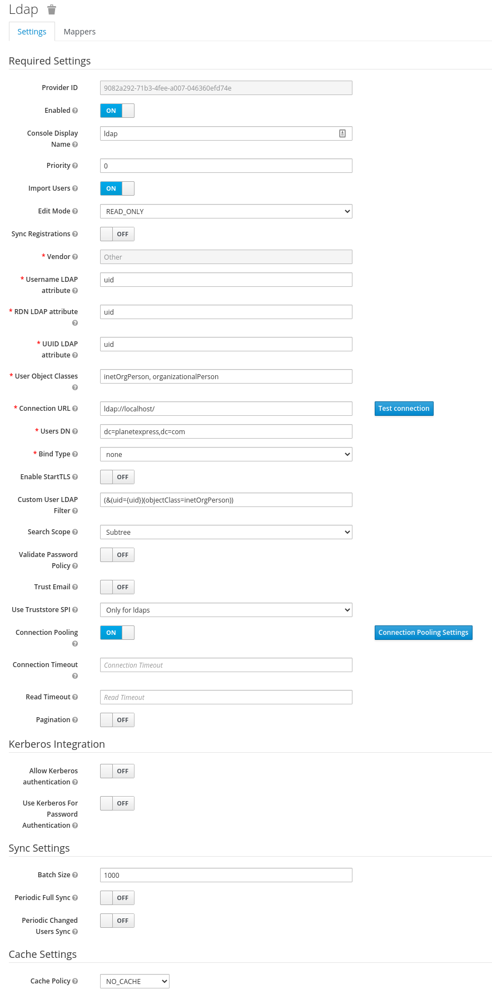

= HLD #14

- Reference ticket: *https://silent8.atlassian.net/browse/WEB-143*
- Reason: Without proper authentication method clients will not be able to login (so use) Web UI.
LDAP is the most universal authentication method which could be used by most of clients.

== New requirements

=== LDAP support

We should use LDAP (widely used as a corporation standard) to authentication all users in our product.
But we shouldn't use it for authorization, as it may be difficult to process requests to add or remove roles for the specific user in the client structures.

=== ReportingUI (other apps) - authentication and authentication

We should have the ability to authentication and authorization in an external application, like Kibana from ELK stack (our ReportingUI).

For Reporting UI it is even more important to have the ability to use roles defined in or application (authorization process) to limit access to Kibana and indexes.

=== Kerberos support (optional)

Right now this is optional, but we may have this request in the future, so we should be prepared for this.

== Current solution

Right now the User can see our Frontend which is communicating with internal Backend Services and with the Keycloak and during the login.The User can see the Keycloak login screen too, which is communicating with the internal Database.

[plantuml,Authorization-and-Authentication-components,svg]
-----
@startuml
title Authorization and Authentication components

actor :User:

package "SERP" {
backend as [Backend Service]
[Frontend]
[Keycloak]
database KeycloakDB
}

User -- Frontend
Frontend - Keycloak
User -- Keycloak
Keycloak -- KeycloakDB
Frontend -- backend
@enduml
-----

Currently we keep all internal users usernames and passwords in the Keycloak database.

[plantuml,Simple-Login-Sequence-Diagram,svg]
-----
@startuml
title Simple Login Sequence Diagram

actor User
participant Frontend
participant Backend
participant Keycloak
database KeycloakDB

User -> Frontend : login
Frontend -> Keycloak : redirect user to the Keycloak
Keycloak -> User : login page
User -> Keycloak : type user and password
Keycloak -> KeycloakDB : authenticate user
KeycloakDB -> Keycloak : user roles
Keycloak -> Frontend : authenticate user - send token with roles
Frontend -> Backend : token with roles
Backend -> Backend : authorize user based on roles from the token
Backend -> Frontend : data

@enduml
-----

The token send by the Keycloak is used by the frontend to authenticate the user and allow the backend to read all roles that the user has.
JSON Web Tokens (JWT) are an open, industry-standard RFC 7519 method for representing claims securely between two parties.
You can take a look at a simple token used on a serp-master: https://jwt.io/#debugger-io?token=eyJhbGciOiJSUzI1NiIsInR5cCIgOiAiSldUIiwia2lkIiA6ICJJSkQtNVZISUdxdzJVLVhIbmV4M2hfeVRSamxLMFZ1Wi1Lek4wZ01NM01rIn0.eyJqdGkiOiI0NWU2NDE5NS01MjE5LTRlNDMtYTJlOS05MGNmNDdlMzVkMzQiLCJleHAiOjE2MDIwNzc4MzUsIm5iZiI6MCwiaWF0IjoxNjAyMDc3NTM1LCJpc3MiOiJodHRwczovL3NlcnAtbWFzdGVyLnNpbGVudGVpZ2h0LmNvbS9hdXRoL3JlYWxtcy9zZW5zLXdlYmFwcCIsImF1ZCI6WyJiYWNrZW5kIiwiYWNjb3VudCJdLCJzdWIiOiJjYTNhYTljMy1lODI4LTQyMDQtYmE5Ni01ZWNkODMwYjQ3YTkiLCJ0eXAiOiJCZWFyZXIiLCJhenAiOiJmcm9udGVuZCIsIm5vbmNlIjoiOGZhNDEwZDEtZGJlMi00YTUzLTg5NjAtNDBkZjkwMjkzMTdkIiwiYXV0aF90aW1lIjoxNjAyMDc3NTM1LCJzZXNzaW9uX3N0YXRlIjoiNzAxZWFhOWQtNmYxZS00NmY3LTk2M2YtYmQyZTM4Njg0YWE0IiwiYWNyIjoiMSIsImFsbG93ZWQtb3JpZ2lucyI6WyJodHRwczovL3NlcnAtbWFzdGVyLnNpbGVudGVpZ2h0LmNvbSIsImh0dHA6Ly9sb2NhbGhvc3Q6MjQ0MTAiXSwicmVhbG1fYWNjZXNzIjp7InJvbGVzIjpbIkF1ZGl0b3IiLCJBbmFseXN0IiwiQWRtaW5pc3RyYXRvciIsIkJ1c2luZXNzIE9wZXJhdG9yIiwiQXBwcm92ZXIiXX0sInJlc291cmNlX2FjY2VzcyI6eyJiYWNrZW5kIjp7InJvbGVzIjpbImF1ZGl0LWdlbmVyYXRlLXJlcG9ydCJdfSwiYWNjb3VudCI6eyJyb2xlcyI6WyJtYW5hZ2UtYWNjb3VudCIsIm1hbmFnZS1hY2NvdW50LWxpbmtzIiwidmlldy1wcm9maWxlIl19fSwic2NvcGUiOiJvcGVuaWQgZW1haWwgcHJvZmlsZSIsImVtYWlsX3ZlcmlmaWVkIjpmYWxzZSwibmFtZSI6InNlcnAiLCJwcmVmZXJyZWRfdXNlcm5hbWUiOiJzZXJwIiwiZ2l2ZW5fbmFtZSI6InNlcnAifQ.Svb43ld7dZOKCr5a6V4TcOKlaQWTVCINJhwpIGwh1G0TzTFasMhOMSxWRW6SKbDEbrT_F3xpjTqdYufzjC03-ukKqLhF9ypiIgfgvjZaafK55YgWj9qFfU_OydxQifweF69BbY1RwxEJb-G8-_RmElIbrDxR-kjfXR7gqBiKCEJUsnSpxaIsuJGHsjHfNDHYmtoo_LiS3Jx7HB_mswob2RMcBxyM1tNACuuCVN5mYW6EAR7AqXo0VSASzx68HJZ_T-lTbxkzBW2O86o1Q67gWbzbDsVUqBqsvqbm6mPw8DFF44z_Plo6rqRdXl_RFfPxQ6Nof8-EYl2ZrbNH910v3g&publicKey=-----BEGIN%20PUBLIC%20KEY-----%0AMIIBIjANBgkqhkiG9w0BAQEFAAOCAQ8AMIIBCgKCAQEAi3B8L54J1A6C2EQAyQnT%0ALx11y4kfKX4KgaY%2Bx%2BTNLD93q3Vrw3quF6xaAY%2Bdn7wDyYEmap6T0qShd5l1X72o%0A2ToWv76igYg78eElOk6PVq3Hmo95NrS4T28mA02zlkvvB49W1STEa5830FPrAPpm%0AuNzSXTlBLh%2BxgBqeBmi%2B6PaeDJyTfmr0DapHTOG8u5wqjeCP8zJhDDmGgmNyWV6W%0AIZmj5aAvR5Rg4iTQjLybkGkbHuCVVZqim4pEXLKFu7CQPbVCgA5pEe2s7358XFwM%0AwGWsVm3p%2BaDhgeK38gkQZfamunUYd3wphVKXkSgxqlyq1dE01ujd3JbWxKr62o83%0A4wIDAQAB%0A-----END%20PUBLIC%20KEY-----%0A[jwt debuger]

We allow synchronizing analysts from the Fircosoft database.
When the admin will execute the sync process, our system will create users in the Keyclaok database based on the users' list in the Fircosoft database.
An additional step required to make it work is to configure the SSO using the SAML description (XML file), to connect Keyclaok with SCB Identity Provider.
Then in our database, we have only usernames and roles, but passwords are kept on the SCB side.

[plantuml,Simple-SSO-Login-Sequence-Diagram,svg]
-----
@startuml
title Simple SSO Login Sequence Diagram

actor Admin
actor User
participant Frontend
participant Backend
participant Keycloak
database KeycloakDB
participant idp as "Identity Provider"

== Configure SAML ==

Admin <- idp : get descriptor (XML file)
Admin -> Keycloak : import descriptor
Keycloak -> Admin : export Keycloak descriptor
Admin -> idp : import Keycloak descriptor

== Sync users ==

Admin -> Backend : sync users from DB
Backend -> Keycloak : sync users
Keycloak -> KeycloakDB : CRUD operations

== Login ==

User -> Frontend : login
Frontend -> Keycloak : redirect user to the Keycloak
Keycloak -> User : login page
User -> Keycloak : use SAML authentications
Keycloak -> idp : authenticate user
idp -> Keycloak : user authentication
Keycloak -> KeycloakDB: get roles
KeycloakDB -> Keycloak : user roles
Keycloak -> Frontend : authenticate user - send token with roles
Frontend -> Backend : token with roles
Backend -> Backend : authorize user based on roles from the token
Backend -> Frontend : data

@enduml
-----

== Proposed solution

[plantuml,Using-LDAP-For-Authentication,svg]
-----
@startuml
title Using LDAP For Authentication

actor Admin
actor User
participant Frontend
participant Backend as "Backend/CLI"
participant Keycloak
database KeycloakDB
database LDAP

== Configure SAML ==

Admin <- idp : get descriptor (XML file)
Admin -> Keycloak : import descriptor
Keycloak -> Admin : export Keycloak descriptor
Admin -> idp : import Keycloak descriptor

== Configure LDAP ==

Admin -> Backend : set LDAP configuration
Backend -> Keycloak : import LDAP configuration
Keycloak -> KeycloakDB : save LDAP configuration

== Create first user ==

Admin -> Backend : create user (no password) with role admin \n(user must exists in ldap)
Backend -> Keycloak : create user with role
Keycloak -> KeycloakDB : save user with role

== Login ==

User -> Frontend : login
Frontend -> Keycloak : redirect user to the Keycloak
Keycloak -> User : login page
User -> Keycloak : provide username and password
Keycloak -> LDAP : authenticate user
LDAP -> Keycloak : user authentication
Keycloak -> KeycloakDB: get roles
KeycloakDB -> Keycloak : user roles
Keycloak -> Frontend : authenticate user - send token with roles
Frontend -> Backend : token with roles
Backend -> Backend : authorize user based on roles from the token
Backend -> Frontend : data

@enduml
-----

=== More detailed view on a processes

[plantuml,Creating-user,svg]
-----
@startuml
title Creating the user

actor admin as "Administrator"

box WebApp
participant Frontend
participant Backend
end box
box Keycloak
participant Keycloak
database KeycloakDB
end box

database LDAP

note over Backend,Keycloak: We assume that we are not allowed to create internal ("Keycloak") users.

== Create user ==

admin -> Frontend : create user with roles
Frontend -> Backend : request to create user with roles
Backend -> Keycloak : search user
Keycloak -> KeycloakDB : search internal Database
Keycloak -> LDAP : search user
LDAP -> Keycloak : user
Keycloak -> KeycloakDB : create  user
Keycloak -> Backend : user
Backend -> Keycloak : set roles for user
Keycloak -> KeycloakDB : set roles
Keycloak -> Backend : user with roles \n(any ok response)
Backend -> Frontend : created
Frontend -> admin : refresh users list \nand present a new user
@enduml
-----

[plantuml,New-LDAP-user,svg]
-----
@startuml
title Login attempt by the user that has an account only in LDAP

actor User

box WebApp
participant Frontend
end box
box Keycloak
participant Keycloak
database KeycloakDB
end box

database LDAP

User -> Keycloak : Login (set login and password)
Keycloak -> KeycloakDB : search internal Database
Keycloak -> LDAP : search user
LDAP -> Keycloak : user
Keycloak -> KeycloakDB : create  user
Keycloak -> Frontend : redirect
Frontend -> User : empty page as user has no roles
@enduml
-----

=== Example configuration in Keycloak

The above configuration was created based on https://github.com/rroemhild/docker-test-openldap[OpenLDAP Docker Image for testing].

=== Things to develop

==== We try to create user with username that already exists in Keycloak

We need to change our call to the Keycloak, to search when we try to create the user, to fetch him from LDAP by the Keycloak.
How we will distinguish responses?

==== User not exists in LDAP

This is quite easy.
Empty search in Keyclaok means we do not have this user.

==== Remove user

Simply delete him from Keycloak?

==== User Id

We should start using Keyclaok ID field (UUID) to identify user not the username.

That would be the simplest solution.

=== To consider

If the client doesn't have LDAP (or in our development env) do we want to have a separate solution to keep users in the internal Keycloak Database.

Maybe we should have our internal LDAP,  that we will use during the development process, testing and will be delivered to the client as our infrastructural product (separate instance of course).

=== To Remember

Do not use the client users' email or id as a username or any other identifier.
Use our own identifier instead.

== Excluded suggestions

=== Use LDAP as a database, and keep there all users.

We cannot do it, as we would need to have a user and password to get a list of all users from LDAP.
It can be difficult for the customer to process and validate our software to get these credentials.

=== Sync users from LDAP to the Keycloak DB.
Same as above.
We would need to have a user and password to get a list of all users from LDAP.
